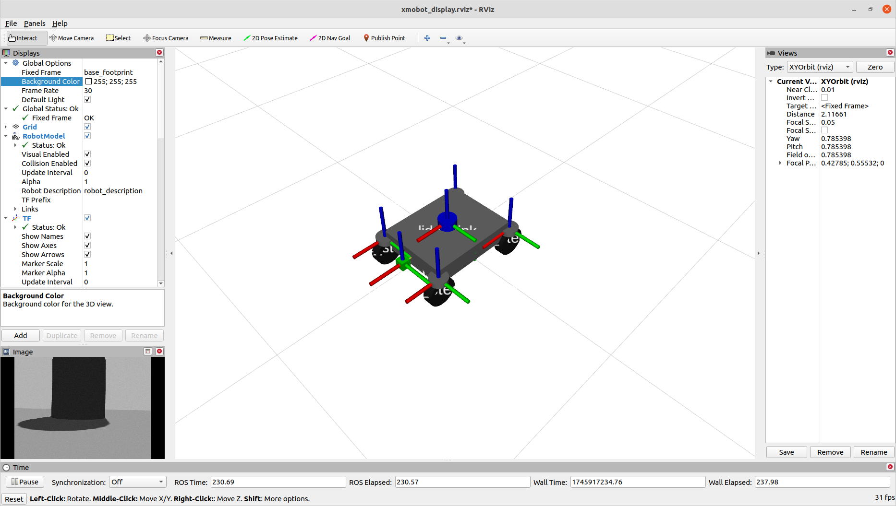
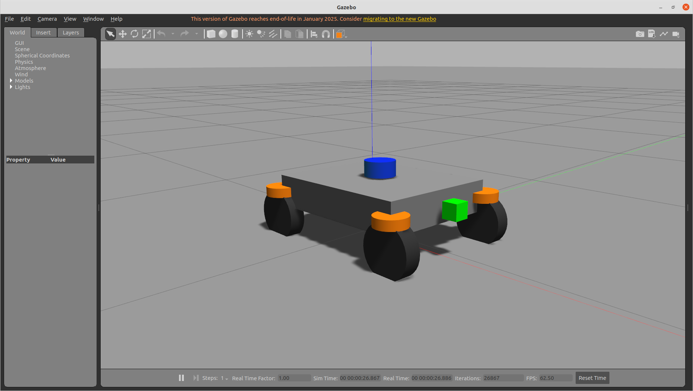
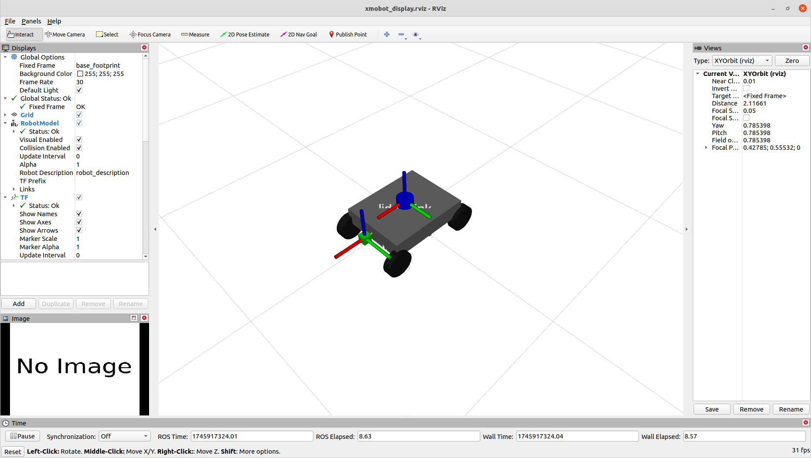
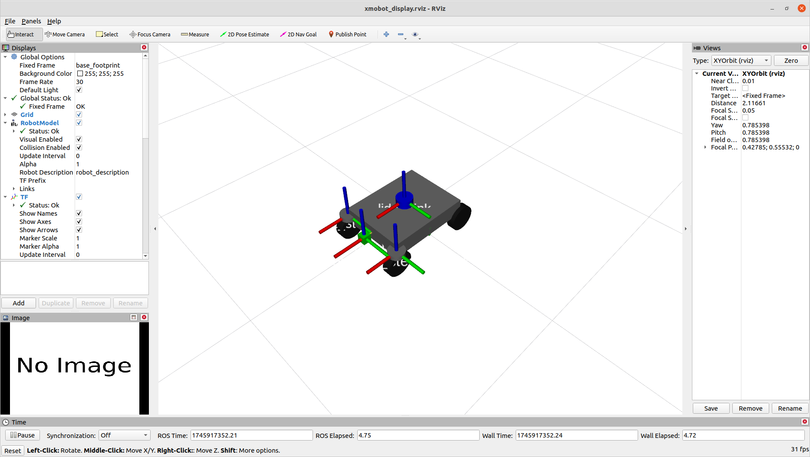
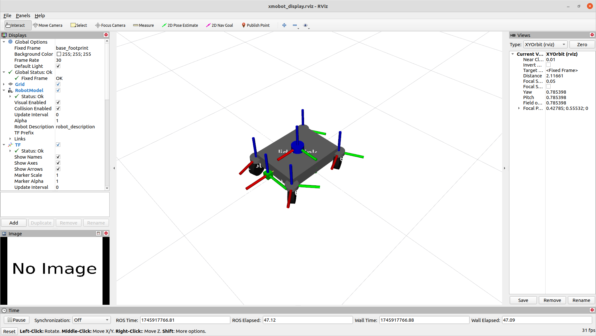
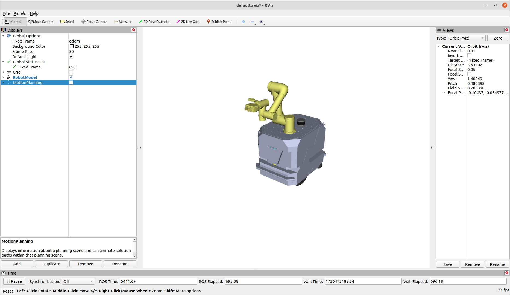
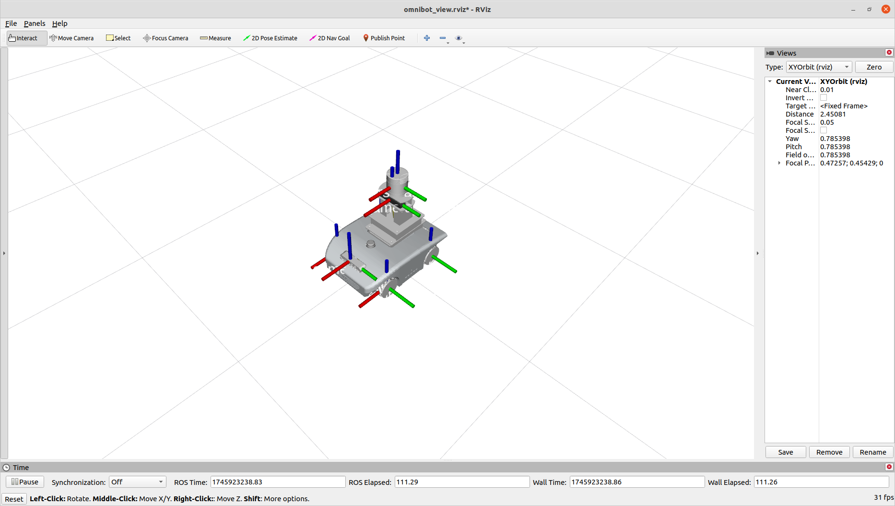
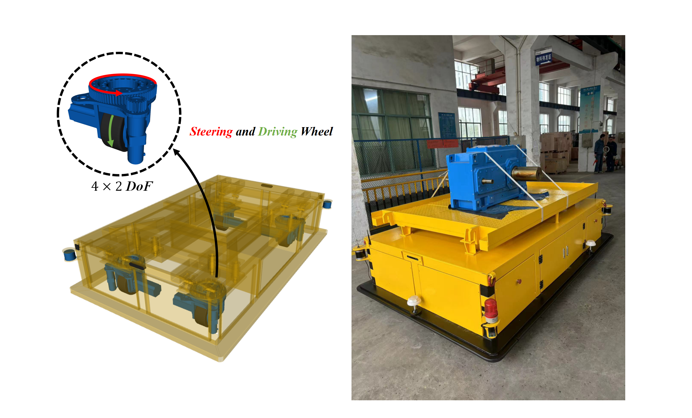

<p align="center">
  
</p>

# Xmobot
Xmobot is a flexible, modular mobile robot platform for SLAM, path planning, and navigation research benchmarking across diverse drive types, including differential, Ackermann, Mecanum (omnidirectional drives), and four-wheel independent steering with driving (4WISD).

---

## Features
- Support for **ROS2 Foxy**
- Modular robot design (X-Shape 4-wheel configuration)
- Parameterized robot size and drive mode
- Equipped with Laser Lidar and Front Camera
- Gazebo simulation ready with ros2_control
- Easy to extend to other mobile bases

---

## System Requirements

- **Ubuntu 20.04 LTS**
- **ROS Foxy** installed and sourced
  - Recommended ROS2 packages:
    ```bash
    sudo apt install ros-foxy-joint-state-publisher ros-foxy-robot-state-publisher ros-foxy-xacro ros-foxy-teleop-twist-keyboard ros-foxy-gazebo-ros2-control ros-foxy-gazebo-ros-pkgs  
    ```
  - Gazebo 9 (provided by ros-foxy-gazebo-ros-pkgs)

If you don't have ROS2 Foxy installed yet, follow [this guide](https://docs.ros.org/en/foxy/Installation/Ubuntu-Install-Debians.html).

---

## Quick Start

### 1. Clone the repository

```bash
cd ~/ros2_ws/src
git clone https://github.com/YeatsWang/xmobot.git --branch ros2
cd ~/ros2_ws
colcon build --symlink-install
source install/setup.zsh
```
If you don't have a catkin_ws workspace yet:
```bash
mkdir -p ~/catkin_ws/src
cd ~/catkin_ws/
catkin_make
```

### 2.Visualize in RViz2
```bash
ros2 launch xmobot display_launch.py
```
This brings up RViz with the modular Xmobot URDF model. You can visualize different drive configurations (diff, mecanum, ackermann, 4wis), along with Lidar and Camera sensors.


### 3. Simulate in Gazebo
```bash
ros2 launch xmobot gazebo_launch.py drive_type:=4wis
```
You will see Xmobot spawned in a simple flat world. You can change the drive_type parameter to test other configurations.


**Available drive type**:
- diff_drive: Differential drive (default)
- mecanum: Omnidirectional drive with mecanum wheels
- ackermann_front: Front-wheel Ackermann steering
- ackermann_rear: Rear-wheel Ackermann steering
- 4wis: Four-Wheel Independent Steering (with driving)

To switch between drive modes, simply pass the desired drive_type:
```bash
roslaunch xmobot gazebo.launch drive_type:=4wis
```
Make sure your controller configuration in config/controllers.yaml matches your selected drive type.
#### Differential Drive or Mecanum Drive: drive_type:=diff_drive or mecanum

#### Ackermann Front Steering: drive_type:=ackermann_front

#### Ackermann Rear Steering: drive_type:=ackermann_rear

#### Four-Wheel Independent Steering and Driving : drive_type:=4wis


### 4. Low-Level Controller Testing (Recommended)
You can directly test velocity and steering controllers without requiring teleop or navigation stack:

**Publish wheel velocities (rad/s):**
~~~bash
ros2 topic pub /velocity_controller/command std_msgs/msg/Float64MultiArray "data: [2.0, 2.0, 2.0, 2.0]" -r 10
~~~
**Publish steering angles (rad):**
~~~bash
rostopic pub /front_left_steering_controller/command std_msgs/Float64 "data: 0.2"
rostopic pub /front_right_steering_controller/command std_msgs/Float64 "data: 0.2"
rostopic pub /rear_left_steering_controller/command std_msgs/Float64 "data: -0.2"
rostopic pub /rear_right_steering_controller/command std_msgs/Float64 "data: -0.2"
~~~
**Check loaded controllers:**
~~~bash
ros2 service call /controller_manager/list_controllers controller_manager_msgs/srv/ListControllers
~~~
### 5. Keyboard Teleoperation
If you have implemented a kinematic conversion layer, you can use keyboard teleoperation to control it:
~~~bash
ros2 run teleop_twist_keyboard teleop_twist_keyboard --ros-args -r cmd_vel:=/cmd_vel
~~~

---

## Project Structure
```plaintext
xmobot/
├── README.md             # 项目首页描述
├── urdf/
│   ├── xmobot_base.xacro         # 基础机器人主体
│   ├── xmobot_inertial.xacro     # 惯性矩阵计算
│   ├── xmobot_sensors.xacro      # 激光雷达+相机模块
│   ├── xmobot_drive.xacro        # 驱动方式参数（差速、阿克曼、全向）
│   ├── xmobot_gazebo.xacro       # Gazebo仿真设置和Transmission接口
│   ├── xmobot.urdf.xacro         # 主入口，组合调用以上模块
├── config/
│   ├── control_gazebo.yaml       # 控制器参数
├── launch/
│   ├── display_launch.py   # RViz展示
│   ├── gazebo_launch.py    # Gazebo仿真
├── meshes/                 # 模型网格文件
│   ├── base.dae
│   ├── wheel.dae
│   ├── steering_link.dae
│   ├── lidar.stl
│   ├── camera.stl
├── scripts/
│   ├── model_test.py       # 测试脚本
├── worlds/
│   ├── simple_world.world  # Gazebo仿真环境
├── LICENSE
```
---

## Contribution
We welcome contributions!
If you want to:
- Improve mechanical design and model fidelity
- Solve parameters tuning issues (PID + physics parameters optimization)
- Add new sensor modules (3D LiDAR or Depth camera)
- Expand to ROS2 support (URDF/Xacro, Gazebo, Controllers)

Please feel free to submit pull requests or open issues!

---

## Extended Robot Models based on Xmobot
CsuBot: Mobile robot (diff_drive) with manipulator


OmniBot: Mobile robot with Mecanum wheels (The robot system is designed by Prof. Degang Xu research group in Automation School of Central South University)


CsuAmr: Four-Wheel Independent Steering and Driving mobile robot (The robot system is designed by Prof. Degang Xu research group in Automation School of Central South University)


---

## License
This project is licensed under the MIT License - see the [LICENSE](LICENSE) file for details.